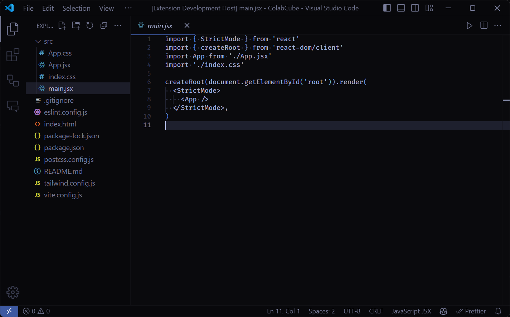
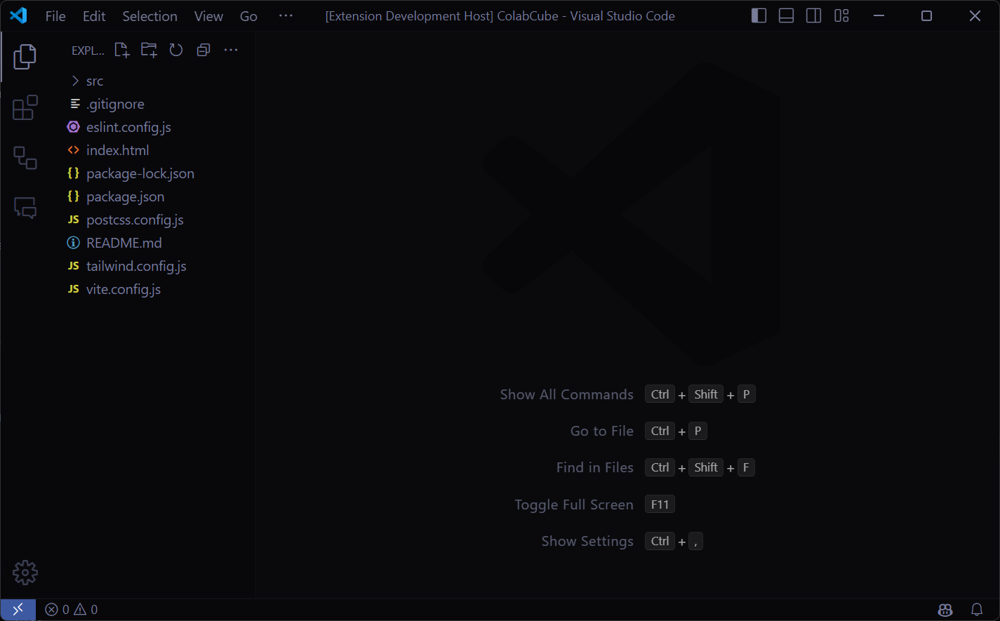

#### Theme Darkula

##### Overview

Welcome to theme vs! This theme is designed to provide a visually appealing and comfortable coding experience. Whether you prefer a dark theme, this extension has you covered.

##### Installation

1. Open Visual Studio Code.
2. Go to the Extensions view by clicking on the Extensions icon in the Activity Bar on the side of the window or by pressing `Ctrl+Shift+X`.
3. Search for "theme-vs".
4. Click the "Install" button.
5. Once installed, go to the Command Palette (`Ctrl+Shift+P`) and type `Color Theme`, then select "theme-vs from the list.

##### Features

- Carefully selected color palette for syntax highlighting.
- Support for various programming languages.
- Consistent and visually appealing UI elements.

##### Usage

To activate the theme:

1. Open the Command Palette (`Ctrl+Shift+P`).
2. Type `Color Theme` and press `Enter`.
3. Select "theme-vs" from the list.

## Contributing

If you have suggestions or find any issues, please feel free to open an issue or submit a pull request on the [GitHub repository](https://github.com/prince-63/theme-vs).

## License

This project is licensed under the MIT License. See the [LICENSE](LICENSE) file for details.

## Screenshots

## Acknowledgements

- Thanks to the VS Code team for their amazing work on the editor.
- Inspired by various themes and color schemes from the community.

**Enjoy coding with Theme VS!**
